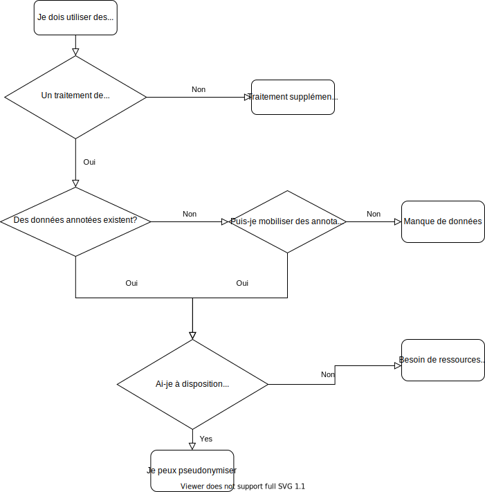

# Partie 1 : Pourquoi et comment pseudonymiser dans l'administration ?

## Qu'est-ce que la pseudonymisation ? 

### Quelle différence entre anonymisation et pseudonymisation ?

Nous reprenons ici l'explication présentée dans le [guide de la CNIL sur l'anonymisation des données](https://www.cnil.fr/fr/lanonymisation-des-donnees-un-traitement-cle-pour-lopen-data) : 

***
> « La pseudonymisation est un traitement de données personnelles réalisé de manière à ce qu'on ne puisse plus attribuer les données relatives à une personne physique sans avoir recours à des informations supplémentaires. En pratique **la pseudonymisation consiste à remplacer les données directement identifiantes** (nom, prénom, etc.) d’un jeu de données par des données indirectement identifiantes (alias, numéro dans un classement, etc.).

> La pseudonymisation permet ainsi de traiter les données d’individus sans pouvoir identifier ceux-ci de façon directe. En pratique, il est toutefois bien souvent possible de retrouver l’identité de ceux-ci grâce à des données tierces. C’est pourquoi des données pseudonymisées demeurent des données personnelles. **L’opération de pseudonymisation est réversible, contrairement à l’anonymisation**. » 
*** 

Pour résumer, des données pseudonymisées ne sont pas tout à fait anonymes, mais ne permettent pas non plus de réidentifier directement les personnes. La pseudonymisation a pour effet de réduire la corrélation entre les données directement identifiantes et les autres données d'une personne. 

### Pourquoi pseudonymiser ?

La [loi n°2016-1321 pour une République numérique](https://www.legifrance.gouv.fr/affichLoiPubliee.do?idDocument=JORFDOLE000031589829&type=general&legislature=14) fait de **l’ouverture des données publiques la règle par défaut**. Etalab a d'ailleurs publié [un guide détaillé sur l'ouverture de ces données](https://guides.etalab.gouv.fr/juridique/ouverture/#la-communication-de-vos-documents-administratifs).

Lorsque les administrations diffusent dans ce cadre des documents contenant des données personnelles, **l'occultation préalable des éléments à caractère personnel est une obligation légale** qui s’impose à elles en application de l'[article L. 312-1-2](https://www.legifrance.gouv.fr/affichCodeArticle.do?idArticle=LEGIARTI000033205514&cidTexte=LEGITEXT000031366350&dateTexte=20161009)  du Code des relations entre le public et l’administration (CRPA). 

Pour satisfaire à cette obligation légale, **la CNIL préconise d'anonymiser** les documents administratifs avant de les diffuser, garantissant ainsi une parfaite impossibilité de réidentification. Néanmoins, pour les documents administratifs qui contiennent des données non structurées, en particulier du texte libre, **une complète anonymisation est difficile à atteindre et peut aboutir à une trop grande perte d'informations**, comme nous le verrons par la suite.

### Quelles données personnelles dois-je retirer de mon jeu de données ?

Cela dépend du contexte réglementaire, le même cadre ne s'appliquant pas à tous les documents. Néanmoins, il conviendra la plupart du temps de **pseudonymiser toute information se rapportant à une personne physique identifiée ou identifiable**. Une « personne physique identifiable » est une personne physique qui peut être identifiée, directement ou indirectement, notamment par référence à un identifiant tel qu'un nom, un numéro d'identification, des données de localisation, un identifiant en ligne, ou à un ou plusieurs éléments spécifiques propres à son identité physique, physiologique, génétique, psychique, économique, culturelle ou sociale.

Un bon exemple de document administratif pseudonymisé sont les décisions de justice, diffusées notamment sur le site Légifrance, [dont voici un exemple](https://www.legifrance.gouv.fr/affichJuriJudi.do?oldAction=rechJuriJudi&idTexte=JURITEXT000041701871&fastReqId=757329309&fastPos=1). Y sont retirés notamment les noms, prénoms, adresses, dates civiles (naissance, décès, mariage) des personnes physiques. D'autres catégories d'informations, comme les noms d'entreprises, la description de faits (dates et montants d'une transaction par exemple) pourraient permettre, en les recoupant avec d'autres informations, de réidentifier une personne physique. Cependant, retirer trop de catégories d'informations reviendrait à perdre beaucoup d'informations et appauvrirait le contenu d'une décision. **Il y a donc un arbitrage à faire entre la minimisation du risque de réidentification et la préservation de l'utilité des données.** Trouver le bon curseur n'est pas simple et doit passer par une analyse des risques de réidentification. Le rapport du [groupe de travail du G29 sur la protection des personnes à l'égard du traitement des données à caractère personnel](https://www.cnil.fr/sites/default/files/atoms/files/wp216_fr.pdf) présente une analyse de ces risques et d'autres exemples de risques de réidentification après pseudonymisation. 

## Quelles méthodes de pseudonymisation ?

### Dans le cas où les données à caractère personnel sont tabulaires

Lorsque les données à caractère personnel sont contenues dans un jeu de données tabulaire (c'est-à dire, pour faire simple, sous forme d'un tableau dont les lignes sont des entrées et les colonnes des catégories d'information), il est aisé de procéder directement à des traitements visant à pseudonymiser ou anonymiser, en **supprimant les colonnes concernées ou en chiffrant leur contenu**. Ce cas de figure n'est pas l'objet de ce guide. Pour plus d'informations à ce sujet, on se référera [aux ressources de la CNIL sur l'anonymisation](https://www.cnil.fr/fr/lanonymisation-des-donnees-un-traitement-cle-pour-lopen-data).

### Dans le cas où les données à caractère personnel apparaissent dans du texte libre

Lorsque les données à caractère personnel sont contenues dans du texte libre, le ciblage précis des éléments identifiants dans le texte est une tâche souvent complexe. Lorsqu'elle est réalisée par des humains, **cette tâche est coûteuse en temps et peut requérir une expertise spécifique dans la matière traitée** (dans les textes juridiques par exemple). L'intelligence artificielle et les techniques de traitement du langage naturel peuvent permettre d'automatiser cette tâche souvent longue et fastidieuse. 

### Puis-je utiliser l'intelligence artificielle (IA) pour pseudonymiser ?

L'utilisation de l'IA pour automatiser la pseudonymisation de documents peut être plus ou moins pertinente. Les solutions d'IA pour pseudonymiser des données textuelles sont en grande majorité des modèles supervisés. **Ces modèles d'IA dits d'apprentissage supervisé se sont beaucoup développés ces dernières années**, en particulier les modèles dits de « deep learning » qui sont aujourd'hui les plus performants. Mais pour que ces modèles puissent arriver à de bonnes performances, un certain nombre de prérequis sont à remplir, que nous détaillons dans les paragraphes de cette section. 

Il existe d'autres méthodes permettant d'automatiser la tâche de pseudonymisation, comme **les moteurs de règles**. Les moteurs de règles sont un ensemble de règles prédéfinies "à l'avance". Par exemple, une règle de pseudonymisation pourrait être "si le mot qui suit Monsieur ou Madame commence par une majuscule alors ce mot est un prénom". La complexité du langage naturel et la diversité des formulations qui se trouvent dans les documents fait que ce type de moteur de règles a de forte chance de faire beaucoup d'erreurs. 

Nous présentons ci-après quelques paramètres à prendre en compte pour juger de la pertinence de l'utilisation de l'IA pour pseudonymiser. 

#### Disposer de données annotées 

Dans le champ de l'apprentissage automatique, les modèles supervisés sont des algorithmes qui prennent en entrée des données avec des "labels" afin qu'ils "apprennent", lorsqu'on leur présente une nouvelle donnée "non-labelisée", à lui attribuer le bon label. 

Dans le cas de la pseudonymisation, **les labels sont les catégories que l'on attribue à chaque mot d'un document (nom, prénom, adresse, etc.)**. Ces catégories varient selon la nature du document et le degré de pseudonymisation souhaité. En traitement du langage naturel, ce type de tâche s'appelle la reconnaissance d'entités nommées (*Named Entity Recognition (NER)* en anglais). 

Lorsqu'elle est réalisée par un humain, **la tâche consistant à attribuer des labels à certains mots ou groupes de mots d'un document s'appelle l'annotation**. Cette tâche pourra nécessiter des compétences spécifiques en fonction de la nature des documents et des catégories à annoter. Dans le cas le plus classique où il s'agira de reconnaître dans un texte des noms et prénoms de personnes physiques, une bonne maîtrise de la langue française est suffisante. On parlera de labélisation pour l'attribution d'un label à un unique mot, et d'annotation le processus de labélisation de l'ensemble des mots d'un document.

Afin de constituer un ensemble de documents annotés qui va servir à entraîner un algorithme d'IA à automatiser cette tâche, il est nécessaire d'utiliser un logiciel d'annotation qui permet d'enregistrer les annotations réalisées par les annotateurs. Il existe de nombreux logiciels d'annotation, dont beaucoup sont open source. Nous avons par exemple développé notre propre outil d'annotation à partir de [Doccano](http://doccano.herokuapp.com/), un logiciel open source. 

Être en mesure d'entraîner un algorithme d'IA pour pseudonymiser dépend donc de la disponibilité de documents déjà annotés ou de la possibilité d'annoter des documents soi-même.

#### La qualité et le volume des données

Le volume de documents annotés nécessaires dépendra de la complexité de la tâche de pseudonymisation, qui sera fonction, entre autres, du nombre de catégories d'entités nommées retenues et de la complexité du langage utilisé dans les documents. Il est en général nécessaire d'**annoter de l'ordre d’un à plusieurs milliers de documents afin d'obtenir des résultats optimaux**. 

La qualité des données est un autre critère essentiel qui sera déterminant pour la performance de l'algorithme. On distinguera la qualité des données textuelles brutes et la qualité des annotations réalisées. 

Les données textuelles peuvent se présenter sous différents formats, plus ou moins lisibles. Idéalement, les documents textuels sont stockés au format *txt* ou *json*. Des formats moins standards (*doc*, *pdf*, *png*, etc..) nécessiteront des conversions afin de pouvoir être traités. Lorsque les documents sont au format image (car résultant d'une numérisation de documents papiers), la mise en place d'une brique de [reconnaissance optique de caractères](https://fr.wikipedia.org/wiki/Reconnaissance_optique_de_caract%C3%A8res) sera nécessaire afin de les convertir au format texte. 

La qualité des annotations est également essentielle, et ce pour deux raisons principales : l'apprentissage de l'algorithme et l'évaluation de la performance de l'algorithme. 

Une partie des données annotées va en effet servir à apprendre à l'algorithme à réaliser la tâche. Des données mal annotées (omissions d'entités nommées, attribution de la mauvaise catégorie d'entité) va donc conduire l'algorithme à mal prédire les catégories des mots des nouveaux documents. Une autre partie des données va servir à évaluer la performance de l'algorithme, en comparant les labels prédits par l'algorithme à ceux déterminés "manuellement". **Si les labels issus de l'annotation par des humains ne sont pas fiables, l'évaluation de la performance de l'algorithme ne sera pas fiable.**

#### L'accès à des infrastructures de calcul adéquates

L'apprentissage de modèles de traitement automatique du langage récents, basés sur des réseaux de neurones profonds (deep learning), **nécessite des ressources dédiées et exigeantes**. D'une part, la volumétrie de données nécessaires pour l'entraînement peut mener à la constitution de corpus de plusieurs giga voire teraoctets et peut nécessiter des infrasructures de stockages dédiées, comme des serveurs de stockage. D'autre part, l'entraînement des modèles est pour sa part très gourmand en capacités de calcul, et s'appuie notamment des processeurs graphiques (*GPU* en anglais) qui permettent d'accélérer considérablement le temps de calcul. Même en disposant de GPU de dernières générations, il faut compter plusieurs jours voire plusieurs semaines pour un apprentissage complet du modèle.

